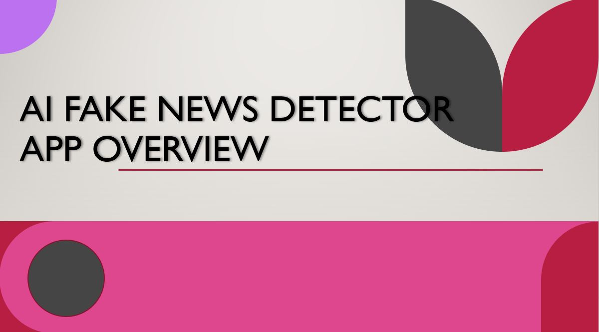
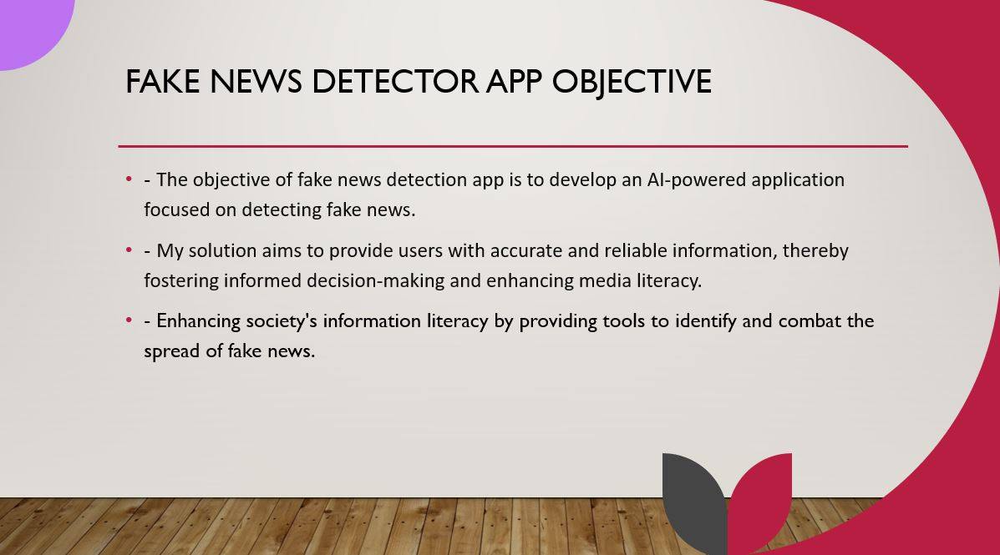
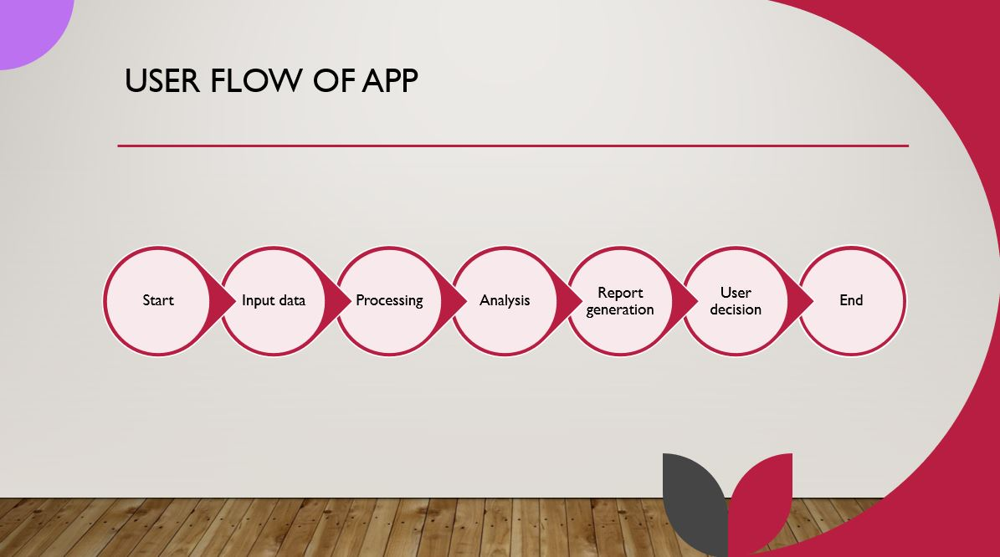
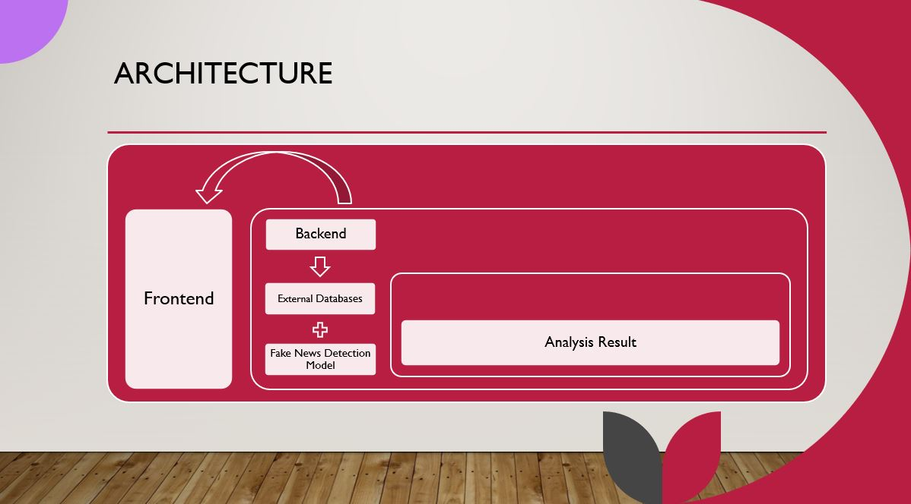
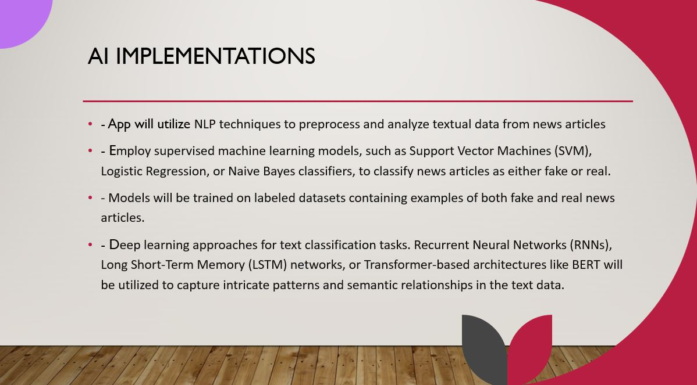
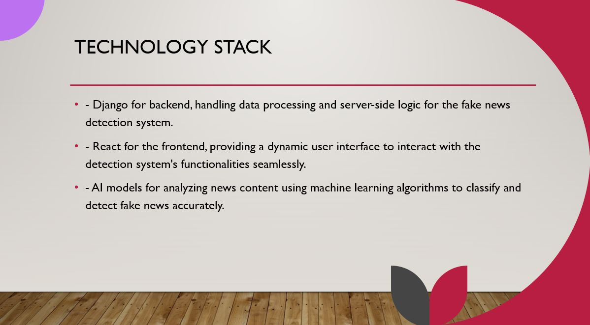

# Project Overview:

Fake News Detector App - it is designed to sift through news articles and separate fact from fiction. Leveraging advanced AI models, our app analyzes text content to identify misleading or inaccurate information, helping users make informed decisions and combat misinformation. Stay vigilant against misinformation and ensure the credibility of your news sources with our intuitive and reliable Fake News Detector.

